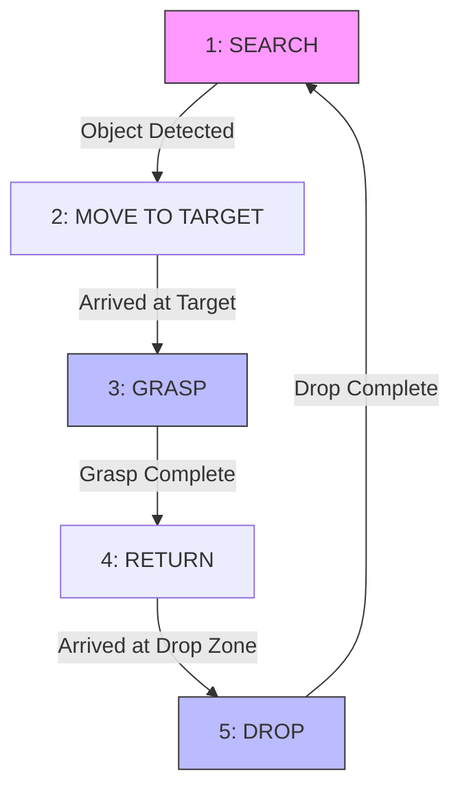

### README.md 

```markdown
# Robot Control System

A modular ROS 2 Jazzy package implementing a finite state machine (FSM) for a "Search-Grasp-Transport-Drop" robotic task. This system integrates vision (simulated), manipulator control, navigation logic, and coordinate transformations.

## ⚠️ Important Implementation Note

**Please read this before running the nodes.**

This package contains **pseudocode** and simulation placeholders to demonstrate the architectural logic. You are expected to implement the hardware interfaces:

1.  **Camera Node (`camera_node.py`)**:
    * Replace the simulated `is_target_found = True` logic in `camera_logic()` with actual Computer Vision code (e.g., OpenCV, YOLO).
2.  **Manipulator Node (`manipulator_node.py`)**:
    * Replace the `time.sleep()` calls in `move_arm_to_pose()` and `set_gripper()` with actual hardware driver commands (e.g., MoveIt! API or serial commands).

---

## 1. System Architecture

### Node Descriptions

Based on the `setup.py` configuration, the package consists of the following nodes:

| Node Entry Point | Source File | Functionality |
| :--- | :--- | :--- |
| **`fsm_node`** | `robot_fsm.py` | **Central Controller.** Manages the robot's state (Search, Move, Grasp, Return, Drop) and coordinates sub-systems. |
| **`camera_node`** | `camera_node.py` | **Perception.** Simulates object detection, broadcasts detection flags, and publishes the object's TF frame (`/base_link` → `/object`). |
| **`manipulator_node`** | `manipulator_node.py` | **Manipulation.** Controls the robotic arm. Listens to TF transforms to calculate grasp poses relative to the arm base. |
| **`nav_node`** | `nav_node.py` | **Navigation.** Handles chassis movement requests from the FSM and reports arrival. |
| **`tf_sim_node`** | `tf_sim_node.py` | **Simulation Environment.** Publishes the static and dynamic TF tree (`map` → `odom` → `base_link` → sensors) for testing without real hardware. |

---

## 2. Finite State Machine (FSM)

The core logic is driven by a 5-stage loop. The cycle repeats **3 times** before the program terminates automatically.

### State Transitions

| ID | State | Description | Transition Trigger (Topic) | Next State |
| :--- | :--- | :--- | :--- | :--- |
| **1** | **SEARCH** | Robot searches for the target. <br>*(Flags: Moving=True, Arm=False)* | `/detected_object` → `True` | **MOVE** |
| **2** | **MOVE** | Robot moves towards the target. <br>*(Flags: Moving=True, Target=True)* | `/move_feedback` → `True` | **GRASP** |
| **3** | **GRASP** | Robot grabs the object. <br>*(Flags: Arm=True, Moving=False)* | `/manipulator_feedback` → `True` | **RETURN** |
| **4** | **RETURN** | Robot carries object to drop zone. <br>*(Flags: Moving=True, Return=True)* | `/move_feedback` → `True` | **DROP** |
| **5** | **DROP** | Robot releases the object. <br>*(Flags: Arm=True, Return=True)* | `/manipulator_feedback` → `True` | **SEARCH** |

### Logic Diagram



---

## 3. Communication Interfaces

This system requires the `my_robot_interfaces` package.

### Custom Messages

* **`ErrorStatus.msg`**: `bool error_state`, `int32 error_number`
* **`ObjectTarget.msg`**: `bool observe_state`, `string object_name`,  `string color`

### Topic Map

| Topic Name | Type | Publisher | Subscriber | Description |
| --- | --- | --- | --- | --- |
| `/detected_object` | `Bool` | Camera | FSM | Triggers "Search" → "Move" |
| `/object_detail` | `ObjectTarget` | Camera | Manipulator | Provides target name for TF lookup |
| `/move_feedback` | `Bool` | Nav Node | FSM | Signals chassis arrival |
| `/manipulator_feedback` | `Bool` | Manipulator | FSM | Signals arm action completion |
| `/status/moving` | `Bool` | FSM | Nav Node | Enable/Disable movement |
| `/status/arm_active` | `Bool` | FSM | Manipulator | Enable/Disable arm control |
| `/status/returning` | `Bool` | FSM | Nav Node | Indicates "Return" phase |
| `/status_error` | `ErrorStatus` | External | FSM | **Emergency Stop** |

---

## 4. Usage Guide

### Prerequisites

1. **ROS 2 Jazzy** installed.
2. **`my_robot_interfaces`** package built and sourced.

### Build

```bash
cd ~/ros2_ws
colcon build --packages-select robot_control_system
source install/setup.bash

```

### Run (Multi-Terminal Setup)

Open 5 separate terminals to visualize the workflow:

**Terminal 1: TF Simulator (Environment)**

```bash
ros2 run robot_control_system tf_sim_node

```

**Terminal 2: FSM (Controller)**

```bash
ros2 run robot_control_system fsm_node

```

**Terminal 3: Camera (Perception)**

```bash
ros2 run robot_control_system camera_node

```

**Terminal 4: Manipulator (Action)**

```bash
ros2 run robot_control_system manipulator_node

```

**Terminal 5: Navigation (Simulation)**

```bash
ros2 run robot_control_system nav_node

```

### Manual Testing

If you don't have the `nav_node` logic implemented, you can manually trigger transitions:

* **Trigger Movement Complete:**
```bash
ros2 topic pub --once /move_feedback std_msgs/msg/Bool "{data: true}"

```


* **Trigger Error (Shutdown):**
```bash
ros2 topic pub --once /status_error my_robot_interfaces/msg/ErrorStatus "{error_state: true, error_number: 500}"

```


```

```